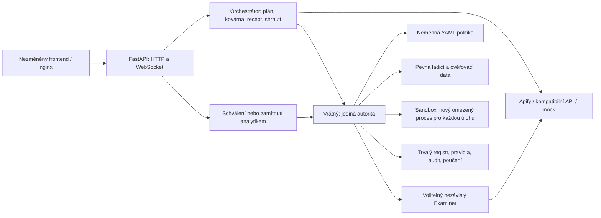

# Frankenstein: schopnosti se vyvíjejí, autorita zůstává

Analytik popíše detekci česky. Jazykový model vybere nástroje, navrhne chybějící čisté Python funkce a sestaví JSON recept. Deterministický vrátný kontroluje každý návrh, měří skutečné výsledky a ukládá změny. Člověk schvaluje až recept, který uspěl na oddělené ověřovací sadě.

## Hranice důvěry

- Orchestrátor importuje pouze veřejné rozhraní vrátného a sdílené datové typy. Nečte data, štítky ani registr a nespouští dovednosti. Toto omezení hlídají testy architektury.
- Vrátný nemá LLM závislosti. Načte ověřené datové sady, provede AST a schématické kontroly, vyhodnotí filtr a spočítá incidenty, TP/FP/FN a hranice úspěchu. Sandbox volá přes HTTP.
- Kandidát musí projít vlastními i nezávislými skrytými testy. Kód, manifest a testy mají otisky. Povýšení kontroluje stejný recept a stejný kód, které prošly ověřením; návrhy jsou před asynchronními operacemi kopírovány.
- Sandbox nemá internet, tajemství, data, registr ani Docker socket. Je read-only s tmpfs, neprivilegovaným uživatelem, omezenými capabilities, pamětí, CPU a počtem procesů. Každá úloha má vlastní adresář, podproces a limity prostředků; runner hlídá importy a I/O.
- Examiner se zapíná příznakem `EXAMINER_ENABLED`. Pouze `main.py` ho předává vrátnému jako funkci. Dostává jen popis útoku a formátu logu. Vrátný staticky ověří generátor, provede jej v sandboxu s oddělenými soukromými seedy, zkontroluje štítky a parser a přidá pevný běžný provoz. Data patří jen danému běhu a nedostanou se k plánovači ani autorovi pravidla.

## Učení a opakování

Schválené dovednosti, pravidla a poučení přežívají restart ve svazku `/data`. Po scénáři A se `distinct_count_window` znovu použije pro distribuovaný brute force ve scénáři B; potřeba další kovárny zmizí. Audit obsahuje řetězené SHA-256 záznamy, změněné artefakty se vyřadí do karantény. Běhy, události a audio jsou záměrně pouze v paměti.

## Veřejný kontrakt

Router je dostupný s `/api` i bez prefixu. Událost se validuje a uloží pod zámkem před neblokujícím broadcastem; pořadí `seq` je stejné přes HTTP i WS. Každý klient má omezenou frontu. Aktivní je nejvýš jeden běh a jeho schválení nebo zamítnutí může vyhrát právě jednou.

## Praktická omezení

Jde o aplikaci pro důvěryhodnou lokální síť bez přihlašování. Hranice orchestrátor–vrátný je modulová, oba běží v jednom procesu. Syntetická data ověřují reprodukovatelné demo, nikoli účinnost na libovolném produkčním provozu. Python sandbox je obrana ve vrstvách; procesové limity a izolace kontejneru jsou zásadní a nemají se vypínat.
